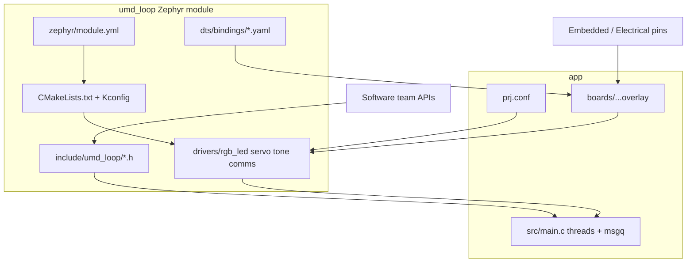

# Part 2 — Zephyr project block diagram & Software coordination

## Directory block diagram

## Important directories

| Path | Role |
|------|------|
| `zephyr/module.yml` | Declares out-of-tree module; points CMake/Kconfig/`dts_root` |
| `drivers/*` | Instantiated drivers (`DEVICE_DT_INST_DEFINE`) |
| `include/umd_loop/` | **Contract with Software** — stable C APIs |
| `dts/bindings/` | DT schema Software/Embedded agree on |
| `boards/*.overlay` | Electrical pin map (Part 0) |
| `app/src/main.c` | Threads: hex / servo / tone / blink / USB demux |

## Coordination with Software

Agreed interface surface:

1. **Headers** — `rgb_led.h`, `servo.h`, `tone.h`, `comms.h` are the only
   symbols the app (and future Software tasks) should call.
2. **Devicetree compatibles** — `umdloop,rgb-led`, `umdloop,servo-pwm`,
   `umdloop,tone`; property names (`red-gpios`, `pwms`, `io-channels`, …).
3. **Thread / msgq contracts** — USB prefixes `H` / `S` / `T` / `N`; HEX wire
   lines are unprefixed `#RRGGBB`. Drivers never block on USB parsing.
4. **Ownership** — Embedded owns overlays + driver Kconfig; Software owns app
   policy (command language, logging). Drivers stay board-agnostic.

## Driver showcase (what to demo)

| Driver | Live demo |
|--------|-----------|
| `rgb_led` | Send `H#10A0E0` or Uno HEX wire → nearest primary LED |
| `servo` | `S120` → move, 2 s later home |
| `tone` | `T880` → pitch; hold time follows pot on GPIO34 |
| `comms` | Parse helpers + status blink via `N200` / I2C byte hook |
